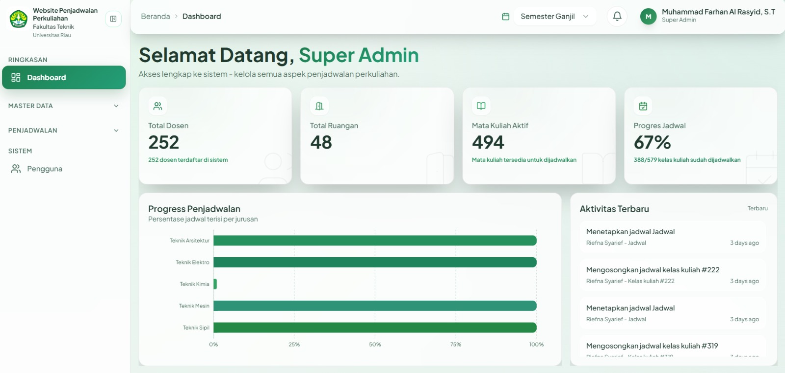
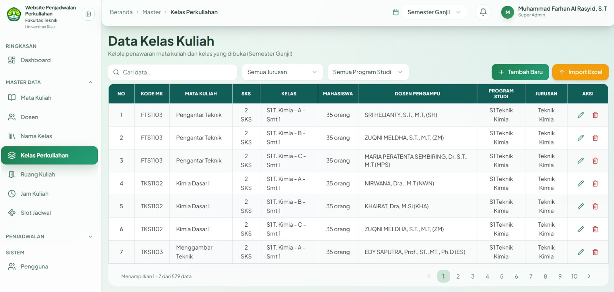
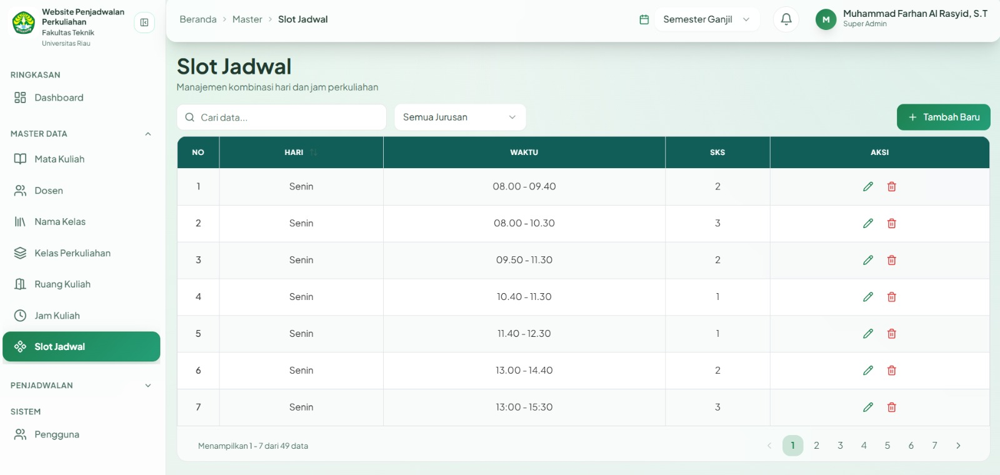
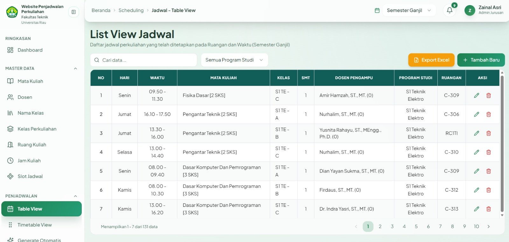
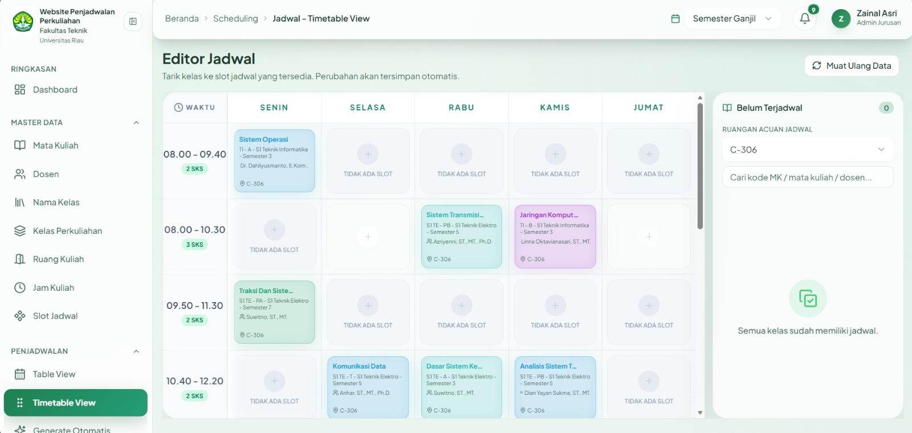
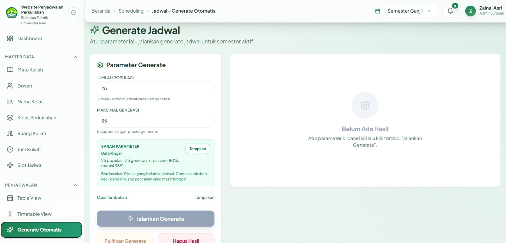
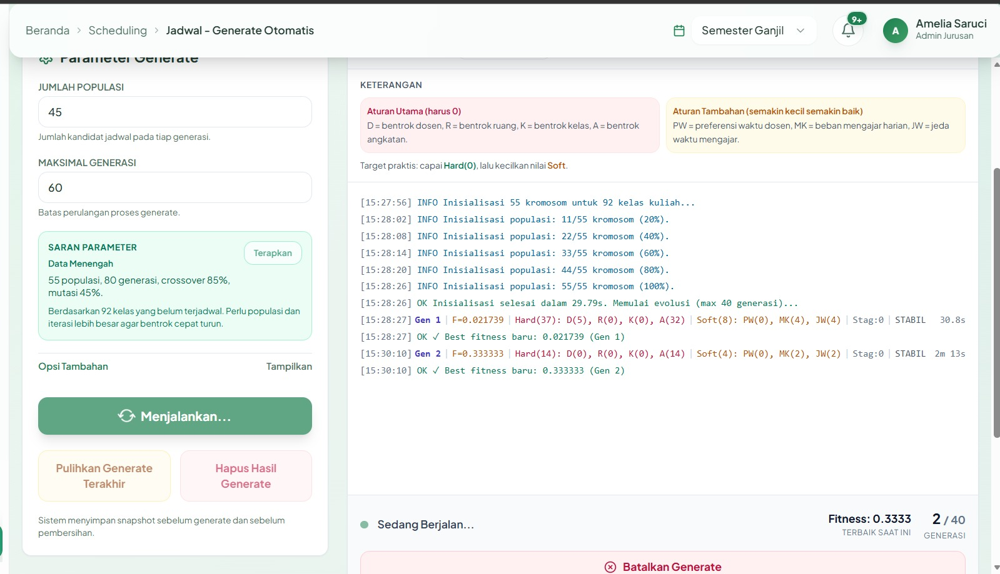
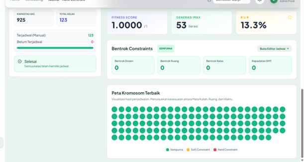

# 🎓 Jadwal Kuliah FT

<div align="justify-content">

### Sistem Penjadwalan Perkuliahan

**Fakultas Teknik — Universitas Riau**

Aplikasi berbasis web yang dirancang untuk membantu proses
pengelolaan, penyusunan, dan pemantauan jadwal perkuliahan
di lingkungan Fakultas Teknik Universitas Riau.

---

## 📖 About The Project

**Jadwal Kuliah FT** merupakan sistem informasi berbasis web yang
dikembangkan untuk membantu proses pengelolaan jadwal perkuliahan
di **Fakultas Teknik Universitas Riau**.

Sistem ini digunakan untuk mengelola berbagai data yang berkaitan
dengan proses penjadwalan, seperti mata kuliah, dosen, kelas
perkuliahan, ruangan, hari, waktu, slot jadwal, serta jadwal
perkuliahan yang telah ditetapkan.

Selain pengelolaan jadwal secara manual, sistem juga menyediakan
fitur **generate jadwal otomatis** dengan parameter tertentu untuk
membantu menghasilkan susunan jadwal yang lebih optimal dan
meminimalkan bentrokan jadwal.

<!-- ---

## 🎯 Project Goals

Project ini dikembangkan dengan beberapa tujuan utama:

- 📅 Mempermudah proses penyusunan jadwal perkuliahan.
- 🏫 Mengelola data ruangan dan resource perkuliahan.
- ⏰ Mengatur hari dan waktu perkuliahan.
- 📚 Mengelola kelas dan kebutuhan SKS mata kuliah.
- 👨‍🏫 Mengelola dosen pengampu mata kuliah.
- 🔄 Membantu proses generate jadwal secara otomatis.
- ⚠️ Mengurangi kemungkinan bentrokan dosen, ruangan, kelas, dan angkatan.
- 📊 Menyediakan pemantauan progres penjadwalan.
- 📥 Menyediakan tampilan jadwal yang dapat diekspor untuk kebutuhan administrasi.

--- -->

## ✨ Main Features

### 🔐 Authentication

### 📊 Dashboard

Dashboard menampilkan ringkasan kondisi penjadwalan, seperti:

- Total dosen
- Total ruangan
- Mata kuliah aktif
- Progres penjadwalan
- Progres penjadwalan berdasarkan jurusan
- Aktivitas terbaru

### 📅 Table View

Menampilkan daftar jadwal perkuliahan dalam bentuk tabel dengan
informasi hari, waktu, mata kuliah, kelas, semester, dosen,
program studi, dan ruangan.

### 🗓️ Timetable View

Menampilkan jadwal dalam bentuk tabel waktu berdasarkan hari.
Kelas dapat ditempatkan pada slot yang tersedia sehingga proses
penyusunan jadwal menjadi lebih mudah dipantau.

### ⚙️ Generate Jadwal Otomatis

Sistem menyediakan proses generate jadwal otomatis dengan parameter
seperti:

- Jumlah populasi
- Maksimal generasi
- Crossover
- Mutasi
- Constraint penjadwalan

Proses generate menampilkan progres dan nilai fitness sehingga
hasil proses dapat dipantau secara langsung.

### 📈 Evaluasi Hasil Generate

Hasil generate dapat dievaluasi berdasarkan beberapa indikator,
antara lain:

- Fitness Score
- Jumlah generasi
- Bentrokan dosen
- Bentrokan ruangan
- Bentrokan kelas
- Kepadatan slot
- Peta kromosom terbaik

---

## 🖥️ Application View

### 🔐 Login

<div align="center">

</div>

### 📊 Dashboard

<div align="center">

</div>

### 📚 Data Kelas Perkuliahan

<div align="center">

</div>

### 🧩 Slot Jadwal

<div align="center">

</div>

### 📋 Table View

<div align="center">

</div>

### 🗓️ Timetable View

<div align="center">

</div>

### ⚙️ Generate Jadwal

<div align="center">

</div>

### 🔄 Proses Generate

<div align="center">

</div>

### 📈 Hasil Generate

<div align="center">

</div>

<!-- ---

## 🏗️ System Workflow

```text
                    ┌───────────────────┐
                    │   Master Data     │
                    ├───────────────────┤
                    │ Mata Kuliah       │
                    │ Dosen             │
                    │ Kelas             │
                    │ Ruangan           │
                    │ Hari & Waktu      │
                    │ Slot Jadwal       │
                    └─────────┬─────────┘
                              │
                              ▼
                    ┌───────────────────┐
                    │  Kelas Perkuliahan│
                    └─────────┬─────────┘
                              │
                              ▼
                    ┌───────────────────┐
                    │ Generate Jadwal   │
                    │     Otomatis      │
                    └─────────┬─────────┘
                              │
                              ▼
                    ┌───────────────────┐
                    │ Evaluasi Fitness  │
                    │ & Constraints     │
                    └─────────┬─────────┘
                              │
                              ▼
                    ┌───────────────────┐
                    │ Jadwal Perkuliahan│
                    │      Terbaik      │
                    └───────────────────┘
```

--- -->

## 🧠 Scheduling Constraints

Proses generate jadwal mempertimbangkan beberapa constraint utama,
di antaranya:

| Constraint          | Keterangan                                         |
| :------------------ | :------------------------------------------------- |
| 👨‍🏫 Bentrok Dosen    | Mencegah dosen mengajar pada waktu yang sama       |
| 🏫 Bentrok Ruangan  | Mencegah penggunaan ruangan secara bersamaan       |
| 👥 Bentrok Kelas    | Mencegah kelas mendapatkan jadwal yang bertabrakan |
| 🎓 Bentrok Angkatan | Mengurangi konflik jadwal berdasarkan angkatan     |
| ⏰ Preferensi Waktu | Mempertimbangkan preferensi waktu tertentu         |
| 📚 Beban Mengajar   | Mempertimbangkan distribusi beban mengajar         |
| 🕐 Jeda Mengajar    | Mempertimbangkan jeda waktu antar perkuliahan      |

---

<!-- ## 🧬 Generate Schedule Process

Proses generate jadwal dilakukan melalui beberapa tahapan:

```text
Parameter Generate
        │
        ▼
Inisialisasi Populasi
        │
        ▼
Evaluasi Fitness
        │
        ▼
Seleksi
        │
        ▼
Crossover
        │
        ▼
Mutasi
        │
        ▼
Evaluasi Ulang
        │
        ▼
Kriteria Berhenti?
     │        │
    Tidak     Ya
     │        │
     └────────┘
        │
        ▼
Jadwal Terbaik
```

--- -->

## 🛠️ Tech Stack

### Frontend

- ⚛️ React
- ⚡ Vite

### Backend

- 🐘 PHP 8.2+
- 🔥 Laravel

### Database

- 🐬 MySQL

---

<!-- ## 🏗️ System Architecture

```text
┌─────────────────────────────┐
│           User              │
└──────────────┬──────────────┘
               │
               ▼
┌─────────────────────────────┐
│       React + Vite          │
│          Frontend           │
└──────────────┬──────────────┘
               │
               ▼
┌─────────────────────────────┐
│          Laravel            │
│           Backend           │
└──────────────┬──────────────┘
               │
               ▼
┌─────────────────────────────┐
│           MySQL             │
│          Database           │
└─────────────────────────────┘
```

--- -->

<!-- ## 📂 Project Structure

```text
JadwalKuliahFT/
│
├── backend/
│   ├── app/
│   ├── database/
│   ├── routes/
│   └── ...
│
├── frontend/
│   ├── src/
│   ├── public/
│   └── ...
│
├── assets/
│   ├── 01-login.png
│   ├── 02-dashboard.png
│   ├── 03-kelas-perkuliahan.png
│   ├── 04-slot-jadwal.png
│   ├── 05-table-view.png
│   ├── 06-timetable-view.png
│   ├── 07-generate-jadwal.png
│   ├── 08-proses-generate.png
│   └── 09-hasil-generate.png
│
└── README.md
```

--- -->

## ⚙️ Installation

### 1. Clone Repository

```bash
git clone https://github.com/USERNAME/JadwalKuliahFT.git
cd JadwalKuliahFT
```

### 2. Backend Setup

```bash
cd backend
composer install
cp .env.example .env
php artisan key:generate
```

Atur konfigurasi database pada file `.env`, kemudian jalankan:

```bash
php artisan migrate
php artisan serve
```

### 3. Frontend Setup

```bash
cd frontend
npm install
npm run dev
```

---

## 🚀 Usage

Setelah backend dan frontend berhasil dijalankan, buka aplikasi
melalui browser.

Administrator dapat:

1. Login ke sistem.
2. Mengelola master data.
3. Mengatur kelas perkuliahan.
4. Mengelola slot jadwal.
5. Melihat jadwal melalui **Table View**.
6. Menyusun dan memindahkan jadwal melalui **Timetable View**.
7. Menjalankan **Generate Jadwal Otomatis**.
8. Mengevaluasi hasil generate.
9. Menetapkan hasil jadwal terbaik.

---

## 👥 Development Team

<div align="center">

| No. | Member                   | Student ID | Role                 |                 GitHub                 |
| :-: | :----------------------- | :--------: | :------------------- | :------------------------------------: |
|  1  | **M Hashfi Fanny AYD**   | 2207112576 | Frontend Development | [GitHub](https://github.com/hashfiayd) |
|  2  | **Aisyah Dwi Syahputri** | 2207113385 | Backend Development  |  [GitHub](https://github.com/aisdwi)   |

</div>

<div align="center">

### 🎓 Jadwal Kuliah FT

**Fakultas Teknik — Universitas Riau**

</div>
